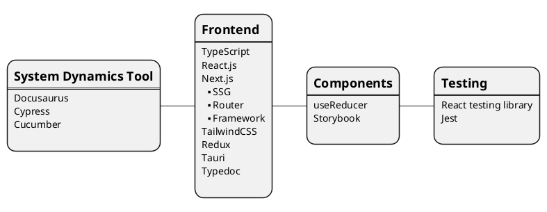

# system-dynamics-tool

This is a [Tauri Next.js](https://tauri.app/v1/guides/getting-started/setup/next-js) project with:
* [React Testing Library with Jest](https://www.freecodecamp.org/news/how-to-setup-react-testing-library-with-nextjs/)
* [Docusaurus with Typedoc](https://github.com/tgreyuk/typedoc-plugin-markdown/tree/master/packages/docusaurus-plugin-typedoc)
* [Storybook With TailwindCSS](https://dev.to/lico/nextjs-using-tailwind-with-storybook-5aie)
* [Cypress](https://docs.cypress.io/guides/tooling/typescript-support)
* [Cucumber](https://github.com/badeball/cypress-cucumber-preprocessor)



## Prerequisites

[Install Rust](https://tauri.app/v1/guides/getting-started/prerequisites)

Initialize npm

```bash
npm i
```

## Getting Started

Development

```bash
npm run tauri dev
```

Build

```bash
npm run tauri build
```

The built execution file is located at ./sif-tauri/target/release
