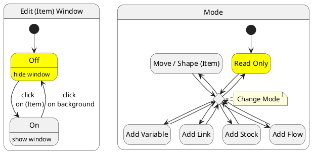
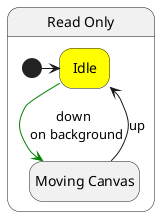
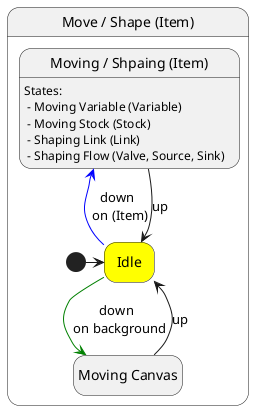
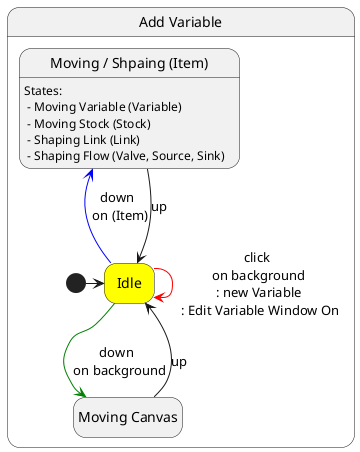
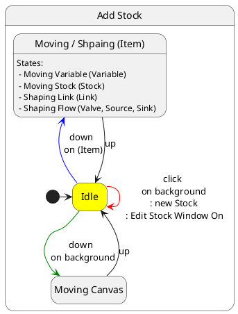
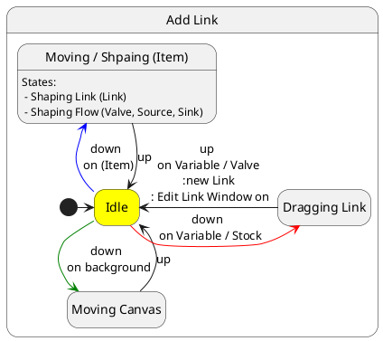
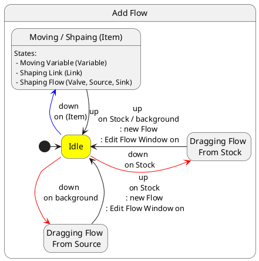

# Interaction

(Item) includes:

- Variable
- Link
- Stock
- Flow
  - Valve
  - Source
  - Sink

## Mouse left down and move

down on background and move:

- Add Flow: creating Flow, up on Stock, edit Flow
- else: move canvas

down on Variable and move:

- Add Link: creating Link, up on Variable or Valve, edit Link
- else: move Variable

down on Stock and move:

- Add Flow: creating Flow, up on Stock or background, edit Flow
- Add Link: creating Link, up on Variable or Valve, edit Link
- else: move Stock

down on Link and move:

- all: shape Link

down on Valve / Source / Sinck and move:

- all: shape Flow

## Mouse left click

click on background:

- Add Variable: create Variable, edit Variable
- Add Stock: create Stock, edit Stock
- else: leave edit

click on items:

- all: edit (Item)

## State Diagram

