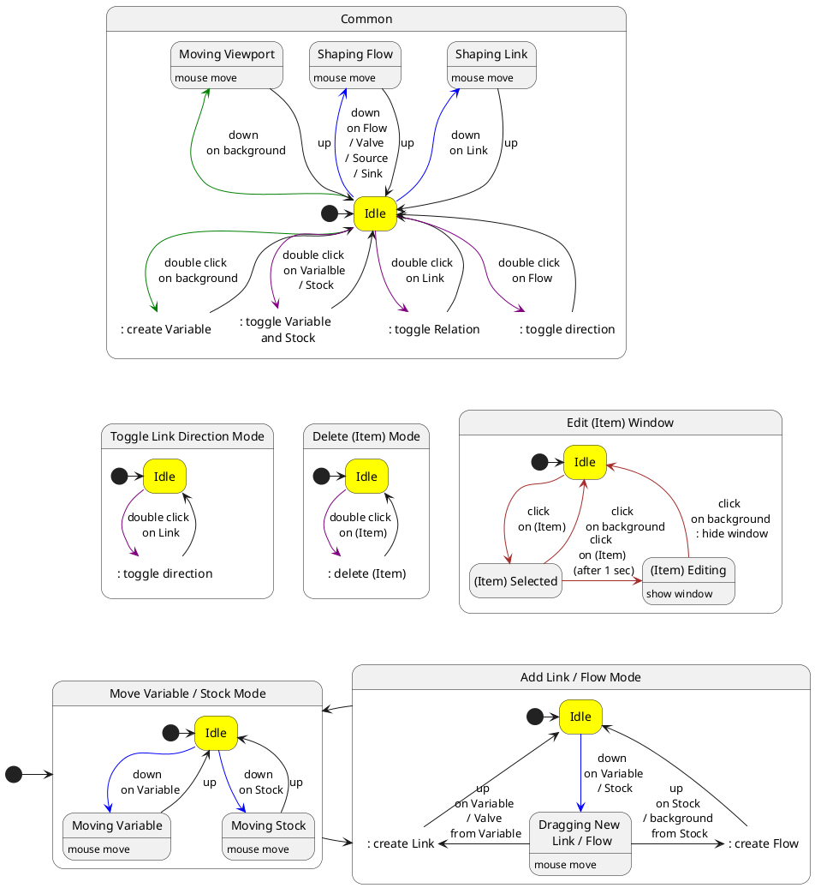

# Interaction

(Item) includes:

- Variable
- Link
- Stock
- Flow
  - Valve
  - Source
  - Sink

## State Diagram

```plantuml
@startuml Interaction
hide empty description

state "Common" as common {
  state "Idle" as idle #yellow
  state "Moving Viewport" as moveViewport : mouse move
  state "Shaping Link" as shapeLink : mouse move
  state "Shaping Flow" as shapeFlow : mouse move
  state ": create Variable" as addVariable #white ##white
  state ": toggle Variable \n and Stock" as toggleVariableStock #white ##white
  state ": toggle Relation" as togglePositiveNegative #white ##white
  state ": toggle direction" as toggleDirection #white ##white

  [*] -> idle
  idle -up[#blue]-> shapeLink : down \n on Link
  shapeLink --> idle : up

  idle -up[#blue]-> shapeFlow : down \n on Flow \n / Valve \n / Source \n / Sink
  shapeFlow --> idle : up

  idle -up[#green]-> moveViewport : down \n on background
  moveViewport --> idle : up

  idle -[#green]-> addVariable : double click \n on background
  addVariable -up-> idle

  idle -[#purple]-> toggleVariableStock : double click \n on Varialble \n / Stock
  toggleVariableStock -up-> idle

  idle -[#purple]-> togglePositiveNegative : double click \n on Link
  togglePositiveNegative -up-> idle

  idle -[#purple]-> toggleDirection : double click \n on Flow
  toggleDirection -up-> idle

}

state "Edit (Item) Window" as editWindow {
  state "Idle" as idleEdit #yellow
  state "(Item) Selected" as selected
  state "(Item) Editing" as editing : show window

  [*] -> idleEdit
  idleEdit -[#brown]-> selected : click \n on (Item)
  selected -up[#brown]-> idleEdit : click \n on background
  selected -[#brown]> editing : click \n on (Item) \n (after 1 sec)
  editing -up[#brown]-> idleEdit : click \n on background \n : hide window
}

state "Delete (Item) Mode" as delete {
  state "Idle" as idleDelete #yellow
  state ": delete (Item)" as deleteItem #white ##white

  [*] -> idleDelete
  idleDelete -[#purple]-> deleteItem : double click \n on (Item)
  deleteItem -up-> idleDelete

}

state "Toggle Link Direction Mode" as toggleLinkDirectionMode {
  state "Idle" as idleLinkDirection #yellow
  state ": toggle direction" as toggleLinkDirection #white ##white

  [*] -> idleLinkDirection
  idleLinkDirection -[#purple]-> toggleLinkDirection : double click \n on Link
  toggleLinkDirection -up-> idleLinkDirection

}

state "Move Variable / Stock Mode" as modeMoveVariableStock {
  state "Idle" as idleMoveVariable #yellow
  state "Moving Variable" as moveVariable : mouse move
  state "Moving Stock" as moveStock : mouse move

  [*] -> idleMoveVariable

  idleMoveVariable -[#blue]-> moveVariable : down \n on Variable
  moveVariable -up-> idleMoveVariable : up

  idleMoveVariable -[#blue]-> moveStock : down \n on Stock
  moveStock -up-> idleMoveVariable : up

}

state "Add Link / Flow Mode" as modeAddLinkFlow {
  state "Idle" as idleAddLink #yellow
  state "Dragging New \n Link / Flow" as dragNewLinkFlow : mouse move
  state ": create Link" as addLink #white ##white
  state ": create Flow" as addFlow #white ##white

  [*] -> idleAddLink

  idleAddLink -[#blue]-> dragNewLinkFlow : down \n on Variable \n / Stock

  dragNewLinkFlow -left> addLink : up \n on Variable \n / Valve \n from Variable
  addLink -up-> idleAddLink

  dragNewLinkFlow -> addFlow : up \n on Stock \n / background \n from Stock
  addFlow -up-> idleAddLink

}

[*] -> modeMoveVariableStock
modeMoveVariableStock -> modeAddLinkFlow
modeAddLinkFlow -left> modeMoveVariableStock

delete -up[hidden]-> common
toggleLinkDirectionMode -[hidden]> delete
delete -[hidden]> editWindow
modeMoveVariableStock -up[hidden]-> toggleLinkDirectionMode

@enduml
```
