# Interaction

## Items

- [x] Variable
- [x] Link
  - [ ] Time Delay
- [x] Stock
- [ ] Flow
  - [ ] Valve
  - [ ] Source
  - [ ] Sink

## Actions

- [x] Move viewport
- [x] Zoom in / out

### Variable

- [x] Create
- [x] Delete
- [ ] _Change style_
- [x] Move
- [x] Change text

### Link

- [ ] Create
  - [x] Variable to Variable
  - [ ] Variable to Valve
  - [x] Stock to Variable
  - [ ] Stock to Valve
  - [ ] Valve to Variable
  - [ ] Valve to Valve
- [x] Delete
- [ ] _Change style_
- [x] Change direction
- [ ] _Change start / end nodes (Variable / Stock / Valve)_
- [x] Change shape
- [x] Change relation

#### Time Delay

- [ ] Create
  - [ ] on Link
- [ ] Delete
- [ ] _Change style_
- [ ] Move
  - [ ] along Link

### Stock

- [x] Create
- [x] Delete
- [ ] _Change style_
- [x] Move
- [x] Change text

### Flow

- [ ] Create
  - [ ] Stock to Sink
  - [ ] Source to Stock
  - [ ] Stock to Stock
- [ ] Delete
- [ ] _Change style_
- [ ] Change direction
- [ ] _Change start / end nodes (Stock / Source / Sink)_

#### Valve

- [ ] Create
  - [ ] on Flow
- [ ] Delete
- [ ] _Change style_
- [ ] Move
  - [ ] along Flow
- [ ] Change text

#### Source

- [ ] _Change style_
- [ ] Move

#### Sink

- [ ] _Change style_
- [ ] Move

## State Diagram

```plantuml
@startuml Interaction
hide empty description

state " " as common #white ##white {

  [*] -> idleEdit
  state "Idle" as idleEdit #yellow
  state "(Item) Editing" as editing : show edit window
  idleEdit -[#darkgoldenrod]> editing : click \n on (Item)
  editing -up[#darkgoldenrod]> idleEdit : click \n on background \n : hide window

  --

  state "Idle" as idle #yellow
  state "Shaping Link" as shapeLink : mouse move
  state "Moving Source / Sink" as moveSourceSink : mouse move

  [*] --> idle
  idle -left[#blue]> shapeLink : down \n on Link \n / Time Delay
  shapeLink -> idle : up

  idle -[#blue]> moveSourceSink : down \n on Source \n / Sink
  moveSourceSink -> idle : up \n on Stock \n : connect
  moveSourceSink -> idle : up

  --

  state "Move Variable / Stock / Valve Mode" as modeMoveVariableStock {
    state "Idle" as idleMoveVariable #yellow
    state "Moving Variable" as moveVariable : mouse move
    state "Moving Stock" as moveStock : mouse move
    state "Moving Valve" as moveValve : mouse move
    state "Moving Viewport" as moveViewport : mouse move

    [*] -> idleMoveVariable

    idleMoveVariable -up[#blue]-> moveVariable : down \n on Variable
    moveVariable --> idleMoveVariable : up

    idleMoveVariable -[#blue]-> moveStock : down \n on Stock
    moveStock -up-> idleMoveVariable : up

    idleMoveVariable -[#blue]-> moveValve : down \n on Flow \n / Valve
    moveValve -up-> idleMoveVariable : up

    idleMoveVariable -up[#green]-> moveViewport : down \n on background
    moveViewport --> idleMoveVariable : up

  }

  state "Create Link / Flow Mode" as modeAddLinkFlow {
    state "Idle" as idleAddLink #yellow
    state "Dragging New \n Link / Flow" as dragNewLinkFlow : mouse move
    state ": create Link" as addLink #white ##white
    state ": create Flow" as addFlow #white ##white
    state "Dragging New \n Flow" as dragNewFlow : mouse move

    [*] --> idleAddLink

    idleAddLink -[#blue]-> dragNewLinkFlow : down \n on Variable \n / Stock \n / Flow

    dragNewLinkFlow -up-> addLink : up \n on Variable \n / Flow \n from Variable \n / Stock \n / Flow
    addLink -> idleAddLink

    dragNewLinkFlow -> addFlow : up \n on Stock \n / background \n from Stock
    addFlow -up-> idleAddLink

    idleAddLink -[#green]> dragNewFlow : down \n on background
    dragNewFlow --> addFlow : up \n on Stock

  }

  [*] -> modeMoveVariableStock
  modeMoveVariableStock -> modeAddLinkFlow
  modeAddLinkFlow -left> modeMoveVariableStock

  --

  state "Create Variable" as createVariableMode {
    state "Idle" as idleCreateVariable #yellow
    state ": create Variable \n : enter text" as createVariable #white ##white

    [*] -> idleCreateVariable
    idleCreateVariable -[#purple]-> createVariable : double click \n on background
    createVariable -up-> idleCreateVariable

  }

  state "Create Stock" as createStockMode {
    state "Idle" as idleCreateStock #yellow
    state ": create Stock \n : enter text" as createStock #white ##white

    [*] -> idleCreateStock
    idleCreateStock -[#purple]-> createStock : double click \n on background
    createStock -up-> idleCreateStock

  }

  [*] -> createVariableMode
  createVariableMode -> createStockMode
  createStockMode -> createVariableMode

  --

  state "Delete (Item) Mode" as deleteItemMode {
    state "Idle" as idleDelete #yellow
    state ": delete (Item)" as deleteItem #white ##white

    [*] -> idleDelete
    idleDelete -[#purple]-> deleteItem : double click \n on (Item)
    deleteItem -up-> idleDelete

  }

  state "Not Delete (Item) Mode" as notDeleteItemMode {
    state "Idle" as idleNotDeleteItemMode #yellow
    state "Editing Text" as editText : show edit box

    [*] -> idleNotDeleteItemMode
    idleNotDeleteItemMode -[#purple]> editText : double click \n on Varialble \n / Stock \n / Valve
    editText -> idleNotDeleteItemMode : press enter \n in edit box

    --

    state "Toggle Link Direction Mode" as toggleLinkDirectionMode {
      state "Idle" as idleLinkDirection #yellow
      state ": toggle direction" as toggleLinkDirection #white ##white

      [*] -> idleLinkDirection
      idleLinkDirection -[#purple]-> toggleLinkDirection : double click \n on Link
      toggleLinkDirection -up-> idleLinkDirection

    }

    state "Toggle Link Relation Mode" as toggleLinkRelationMode {
      state "Idle" as idleLinkRelation #yellow
      state ": toggle relation" as toggleLinkRelation #white ##white

      [*] -> idleLinkRelation
      idleLinkRelation -[#purple]-> toggleLinkRelation : double click \n on Link
      toggleLinkRelation -up-> idleLinkRelation

    }

    state "Toggle Time Delay Mode" as toggleTimeDelayMode {
      state "Idle" as idleTimeDelay #yellow
      state ": toggle Time Delay" as toggleTimeDelay #white ##white

      [*] -> idleTimeDelay
      idleTimeDelay -[#purple]-> toggleTimeDelay : double click \n on Link
      toggleTimeDelay -up-> idleTimeDelay

    }

    [*] -> toggleLinkDirectionMode
    toggleLinkRelationMode -left> toggleLinkDirectionMode
    toggleLinkDirectionMode -> toggleLinkRelationMode
    toggleTimeDelayMode --> toggleLinkRelationMode
    toggleLinkRelationMode --> toggleTimeDelayMode
    toggleTimeDelayMode --> toggleLinkDirectionMode
    toggleLinkDirectionMode --> toggleTimeDelayMode

    --

    state "Toggle Flow Direction Mode" as toggleFlowDirectionMode {
      state "Idle" as idleFlowDirection #yellow
      state ": toggle direction" as toggleFlowDirection #white ##white

      [*] -> idleFlowDirection
      idleFlowDirection -[#purple]-> toggleFlowDirection : double click \n on Flow
      toggleFlowDirection -up-> idleFlowDirection

    }

    state "Create Valve Mode" as toggleCreateValveMode {
      state "Idle" as idleCreateValve #yellow
      state ": create Valve \n : enter text" as toggleCreateValve #white ##white

      [*] -> idleCreateValve
      idleCreateValve -[#purple]-> toggleCreateValve : double click \n on Flow
      toggleCreateValve -up-> idleCreateValve

    }

    [*] -> toggleFlowDirectionMode
    toggleFlowDirectionMode -> toggleCreateValveMode
    toggleCreateValveMode -> toggleFlowDirectionMode

  }

  [*] -> notDeleteItemMode

  notDeleteItemMode -> deleteItemMode
  deleteItemMode -left> notDeleteItemMode

}

@enduml
```

