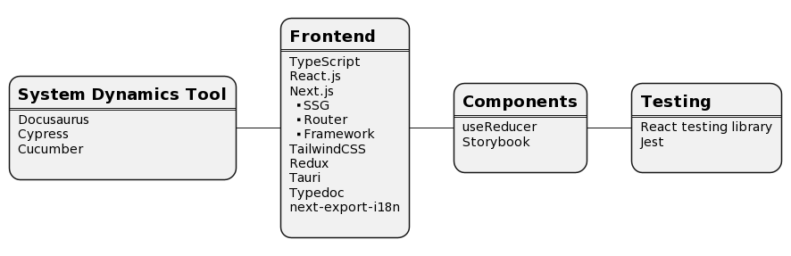
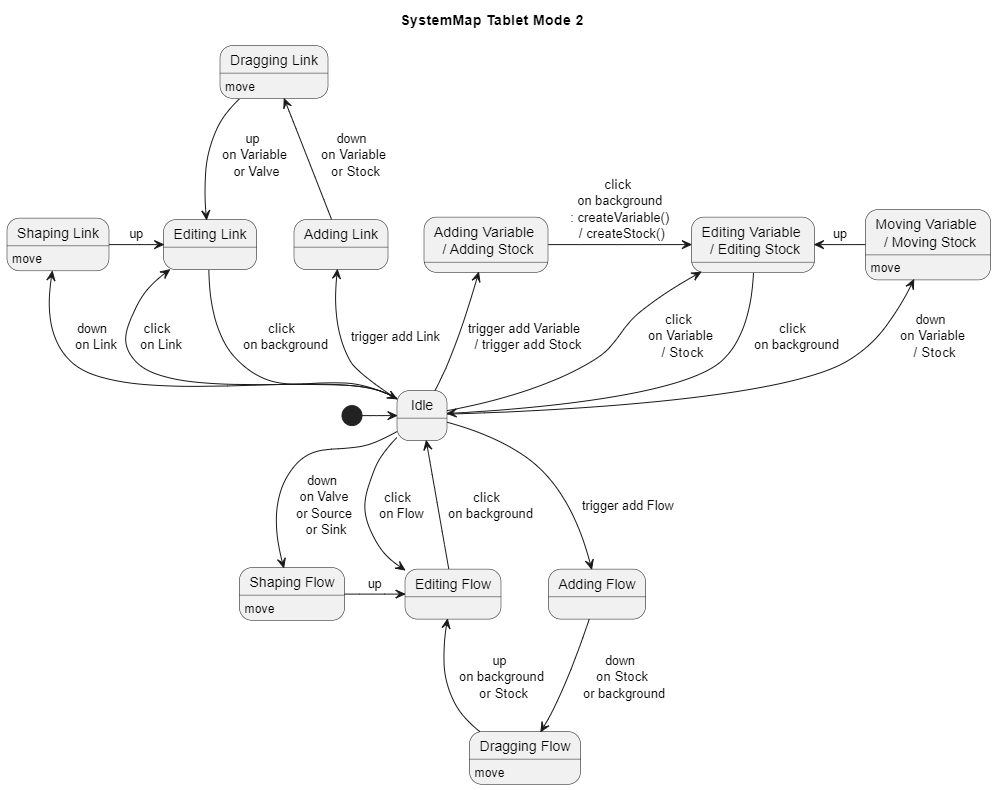

# Plan

For drawing [System Map](https://www.systems-thinking.org/)

## Commands

- File
  - New
  - Save
  - Load
  - Save As
  - Import
  - Export
- Edit
  - Undo
  - Redo
- Tool
  - Find Loops
  - Find Archetypes
  - Apply Force-directed Graph

## Elements

- Causal Loop Diagrm
  - Variable
  - Link
- Stock and Flow Diagrm
  - Stock
  - Flow ( Valve )
  - Source
  - Sink

Element Categories:

- Node
  - Variable
  - Stock
  - Valve
- Edge
  - Link
  - Flow

Derived Concepts:

- Loop
  - Reinforcing
  - Balancing
- Archetype
  - Drifting Goals
  - Escalation
  - Fixes That Fail
  - Growth and Underinvestment
  - Limits to Success
  - Shifting the Burden
  - Success to the Successful
  - Tragedy of the Commons

## Causal Loop Diagrm

### Variable

- shape: can be changed
- from: [ Link ]
- to: [ Link ]
- font
- color

### Link

- shape: arc
- from: [ Variable, Stock ]
- to: [ Variable, Valve ]
- direction ( + / - )
- time delay
- width
- color

## Stock and Flow Diagrm

### Stock

- shape: rectangle
- from: [ Flow ]
- to: [ Flow, Link ]
- font
- color

### Flow

- shape: polyline
- from: [ Source, Stock ]
- to: [ Stock, Sink ]
- width
- color

### Valve

- shape: funnel on Flow
- from: [ Link ]
- color

### Source

- shape: cloud
- to: [ Flow ]

### Sink

- shape: cloud
- from: [ Flow ]

## Interaction

## Loop

A route starting from one Node through Edges and other Nodes and end at the Node itself.

- Reinforcing Loop: The total number of minus Links is even number.

- Balancing Loop: The total number of minus Links is odd number.

## Archetype

https://www.systems-thinking.org/arch/arch.htm

### Accidental Adversaries

### Drifting Goals

### Escalation

### Fixes That Fail

### Growth and Underinvestment

### Limits to Success

### Shifting the Burden

### Success to the Successful

### Tragedy of the Commons
